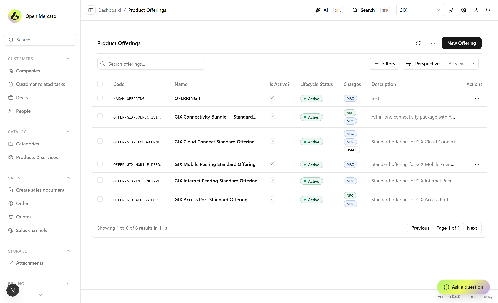
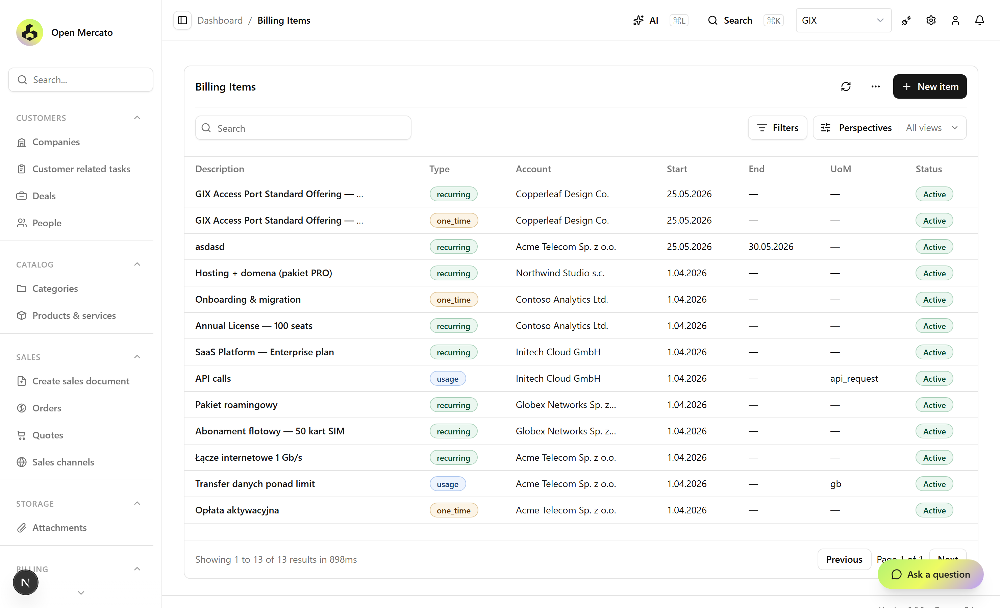
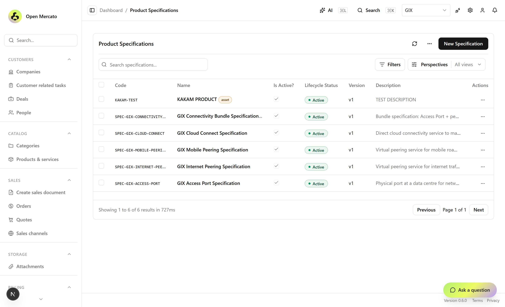
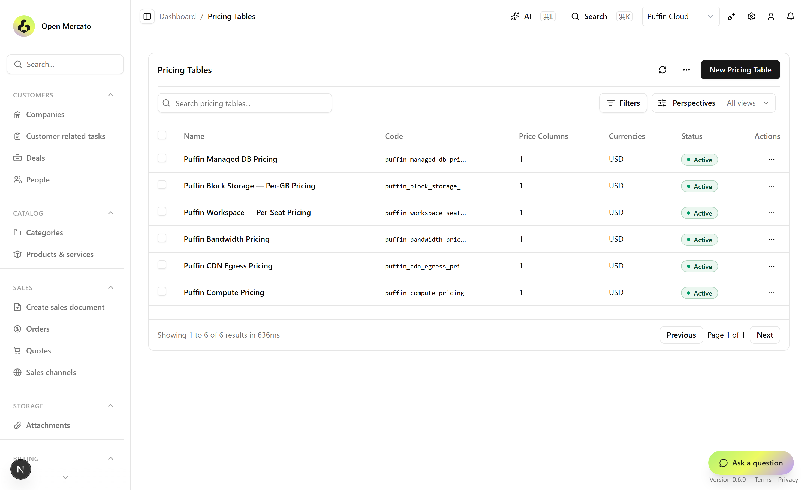
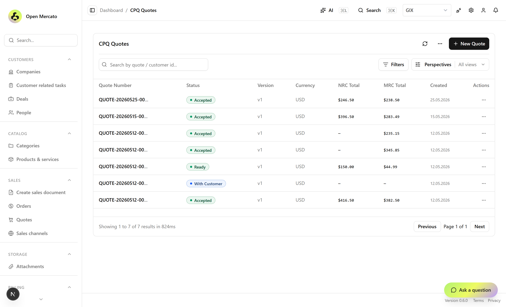
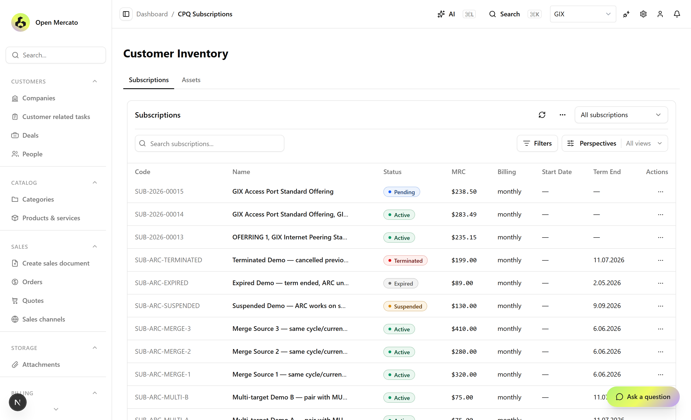
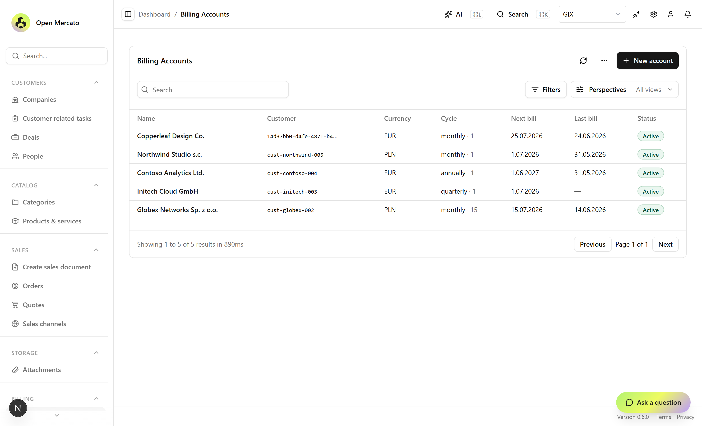
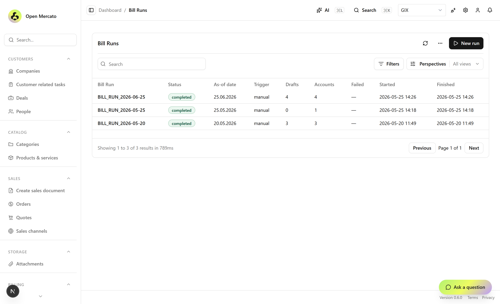
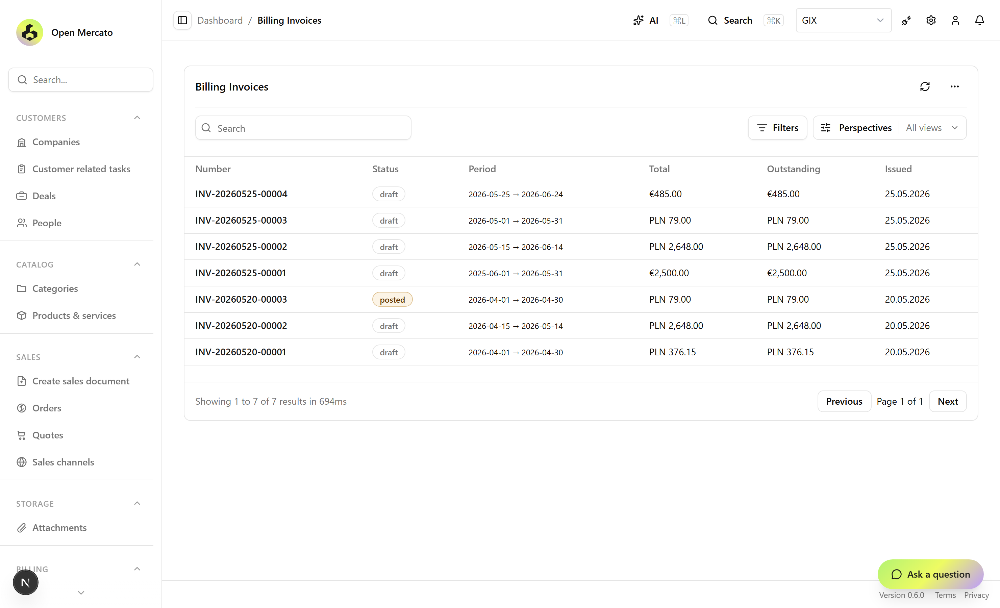

# Dainamite

Open-source **revenue management** framework for subscription businesses —
Product Catalog, **CPQ** (Configure-Price-Quote), Order Management &
**Subscription Billing**.

Tailored to fit your business. Built on open-source foundations for you to
own, with no per-seat tax.

- Website: [dainamite.com](https://dainamite.com)
- Powered by [Open Mercato](https://www.npmjs.com/org/open-mercato)

---

## What this repository is

`dainamite-core` is the **Dainamite product monorepo** *and* the first
reference application built on it. It plays two roles at once:

1. **A publishable package workspace** under [`packages/`](packages/) — the
   `@dainamite/*` product modules that any Open Mercato app can install from
   npm.
2. **A runnable demo app** that consumes those packages exactly the way a
   customer app would, with seeded demo tenants (GIX network services, Puffin
   Cloud) to showcase the flows.

The relationship to Open Mercato follows a three-layer model:

| Layer | What | Where it lives |
|-------|------|----------------|
| **L1** | Open Mercato core framework (modules, DI, events, UI, ORM glue) | `@open-mercato/*` on npm — a peer dependency |
| **L2** | Dainamite product modules (CPQ, Billing, connector) | `@dainamite/*`, published from [`packages/`](packages/) |
| **L3** | Customer applications | `dainamite-core` is the first; new customer repos `yarn add` the L2 packages |

---

## The `@dainamite/*` packages

| Package | Version | Status | What it adds |
|---------|---------|--------|--------------|
| [`@dainamite/cpq`](packages/cpq) | `0.2.x` | ✅ Published (public npm) | Configure-Price-Quote engine |
| [`@dainamite/billing`](packages/billing) | `0.17.x` | 🔜 Publishing soon | Recurring-billing engine (Bill Runs → draft invoices) |
| [`@dainamite/cpq-billing-connector`](packages/cpq-billing-connector) | `0.1.x` | 🔜 Publishing soon | Event bridge: CPQ subscription lifecycle → Billing |

All three are **Open Mercato modules**: self-contained folders that the
framework auto-discovers by filename convention (`index.ts` metadata, `di.ts`,
`acl.ts`, `setup.ts`, `data/entities.ts`, `api/`, `backend/`, `subscribers/`,
`workers/`, `events.ts`). You enable them by listing them in your app's
`src/modules.ts`; the framework wires DI, routes, migrations, ACL, and the
admin UI automatically.

### `@dainamite/cpq` — Configure, Price, Quote

The core selling engine.



- **Products** — product specifications, sellable offerings, configurable
  attributes (design-time vs run-time), and bundled offerings with slots.
- **Pricing** — multi-charge pricing tables, tiered/volume pricing, and
  composable price rules (`discount_percent`, `discount_absolute`,
  `surcharge_*`, `price_override`).
- **Quoting** — guided quote wizards, a configurator, and a calculate-price
  API.
- **Customer inventory** — subscriptions, subscription items, and assets that
  survive after a quote is converted to an order.
- **ARC** — Amend / Renew / Cancel flows against live subscriptions.
- **Orders** — quote → order → activation pipeline.

#### Feature matrix

| Area | Capabilities |
|------|--------------|
| **Products** | Product specifications; sellable offerings (discrete & single-offering); product/offering lifecycle status |
| **Attributes** | Design-time vs run-time attributes; select / text / number types; defaults, help text, required flags; reference attributes with filtered options; attribute dependencies (`dependsOn` — filter options / apply constraints) |
| **Bundles** | Bundled offerings with slots (min/max per slot) and components; bundle-tree resolution |
| **Relationships** | Cross-offering relationships & constraints; relationship validation on quote lines |
| **Pricing** | Multi-charge model (recurring `MRC` / one-time `NRC` / `usage`); pricing tables (single & multi-dimensional); tiered / volume (range) pricing |
| **Price rules** | `discount_percent`, `discount_absolute`, `surcharge_percent`, `surcharge_absolute`, `price_override`; priority-ordered, conditionally applicable |
| **Pricing I/O** | XLSX import / export of pricing tables; calculate-price API (`/api/cpq/quotes/price`) |
| **Quoting** | Quotes & line items; guided multi-step wizards + configurator; clone & recalculate; quote status state machine |
| **Customer inventory** | Subscriptions & subscription items; assets + asset status; expiring-soon / renewal-watch picker; per-subscription change log |
| **ARC** | Amend / Renew / Cancel live subscriptions via quote; merge-renewal (supersede sources); proration + audited change log |
| **Orders** | Quote → order conversion; order activation (provisions inventory, emits lifecycle events); order status state machine |

CPQ piggybacks on Open Mercato `sales` for quote/order **headers** — it never
mutates `sales_*` rows directly; it goes through the sales service or emits
domain events.

**Required Open Mercato modules** (declared in `metadata.requires`, the app
will fail to bootstrap without them):
`auth`, `directory`, `catalog`, `sales`, `customers`, `dictionaries`.

### `@dainamite/billing` — Recurring billing

A lightweight billing engine that does **not** replace your accounting system
— it prepares billing data and hands draft invoices to a human for approval.



- Collects **Billing Items** to charge (`one_time`, `recurring`, `usage`).
- Runs a scheduled **Bill Run** (a background worker) that calculates totals
  and produces **draft invoices in Open Mercato `sales`**.
- Usage rating for metered items; idempotent, tenant-locked runs.
- Full admin UI: Billing Accounts, Items, Bill Runs, and Invoices (with a
  human-approval "post" step before an invoice leaves draft).

#### Feature matrix

| Area | Capabilities |
|------|--------------|
| **Accounts** | Billing Accounts per customer; account-scoped billing windows |
| **Items** | Billing Items typed `one_time` / `recurring` / `usage`, each with a bill start/end window |
| **Bill Runs** | Scheduled (worker) and on-demand runs; **dry-run** preview; idempotent & tenant-locked; stale-run reaping worker |
| **Usage** | Usage ingestion API; usage rating at run time for metered items |
| **Invoices** | Draft invoices written into `@open-mercato/core/sales`; draft edits; human-approval **post** step (guarded ACL action) |
| **Admin UI** | List + detail pages for Accounts, Items, Bill Runs, Invoices under `/backend/billing/*` |
| **ACL** | `billing.{account,item,invoice,run,usage}.*` — incl. `run.dry_run` / `run.trigger`, `invoice.edit_draft` / `invoice.post`, `usage.ingest` |

**Required Open Mercato modules**: `sales`, plus `@open-mercato/queue` for the
Bill Run worker and `@open-mercato/events` for lifecycle events.

### `@dainamite/cpq-billing-connector` — the glue

A pre-built integration so you don't write the CPQ↔Billing wiring yourself. It
subscribes to six CPQ lifecycle events on the Open Mercato **event bus** and
translates each into Billing API calls:

| CPQ event | Connector action |
|-----------|------------------|
| `cpq.subscription.activated` | Create Billing Account if missing; create Billing Items per charge (one-time + recurring split) |
| `cpq.subscription.amended` | Add Items for new lines; post proration for the partial cycle; end-date removed items |
| `cpq.subscription.renewed` | Extend `bill_end_date`; add Items for new lines |
| `cpq.subscription.cancelled` | Set `bill_end_date` on all Items for the subscription |
| `cpq.subscription.merged` | Re-point Items from source subscriptions to the merged one |
| `cpq.subscription.superseded` | Set `bill_end_date` on all Items for the superseded subscription |

It depends on both `@dainamite/cpq` and `@dainamite/billing` (as peers) and
**must be registered after both** so their services are available when its
subscribers fire.

---

## How the packages connect to Open Mercato

These are normal Open Mercato modules — there is no custom plugin runtime.
Concretely:

- **Consumed via `peerDependencies`, never `dependencies`.** `@open-mercato/*`
  and sibling `@dainamite/*` are peers so the whole app shares a *single*
  instance of the framework and ORM in `node_modules`. Your app provides them.
- **Cross-module references are FK strings + framework primitives** — never
  ORM relations across package boundaries. A CPQ quote references a customer
  by `customerId: string`, resolved at runtime; cross-module reactions go
  through the **event bus** (`@open-mercato/events`) and **response
  enrichers**, not direct imports.
- **Each package ships its own migrations.** After installing/upgrading a
  package, `yarn mercato db migrate` applies its schema.
- **Each package ships `src/` (types) and `dist/` (runtime JS).** Following the
  `@open-mercato/core` convention, no `.d.ts` is emitted — `exports.types`
  resolves directly to source. Engines: **Node ≥ 24**.

---

## Installing the packages into an Open Mercato app

> These steps are for adding Dainamite to **your own** Open Mercato
> application. To run *this* repo locally instead, see
> [Local development](#local-development-of-this-monorepo).

### Prerequisites

- An Open Mercato app on **`@open-mercato/* ^0.6.0`** (e.g. created with
  `npx create-mercato-app <name>`).
- **Node ≥ 24**, **Yarn 4.12** (via `corepack enable`), and **Docker** for
  Postgres / Redis / Meilisearch.

### 1 — Install CPQ (available now)

`@dainamite/cpq` is on the **public npm registry** — no scope auth or
`.npmrc` changes needed:

```bash
yarn add @dainamite/cpq
```

Register it in your app's `src/modules.ts` (make sure its required core
modules are already enabled):

```ts
export const enabledModules: ModuleEntry[] = [
  // … core modules: auth, directory, catalog, sales, customers, dictionaries …
  { id: 'cpq', from: '@dainamite/cpq' },
]
```

Regenerate the module graph, then apply migrations:

```bash
yarn generate          # rebuild .mercato/generated/* after editing src/modules.ts
yarn mercato db migrate
```

CPQ admin pages now appear under `/backend/cpq/*`.

### 2 — Add Billing + the connector (publishing soon)

> ⚠️ `@dainamite/billing` and `@dainamite/cpq-billing-connector` are not yet
> on npm. The steps below are the intended install flow once they publish —
> until then they are available only inside this monorepo.

```bash
yarn add @dainamite/billing @dainamite/cpq-billing-connector
```

Register all three modules — **order matters**: the connector must come after
both `cpq` and `billing`:

```ts
export const enabledModules: ModuleEntry[] = [
  // … core modules (incl. queue + events for billing) …
  { id: 'cpq', from: '@dainamite/cpq' },
  { id: 'billing', from: '@dainamite/billing' },
  // MUST be after cpq + billing — its subscribers resolve both services.
  { id: 'cpq_billing_connector', from: '@dainamite/cpq-billing-connector' },
]
```

```bash
yarn generate
yarn mercato db migrate
```

With all three enabled, activating a CPQ quote into a subscription
automatically opens a Billing Account and seeds Billing Items; the scheduled
Bill Run then drafts invoices for human approval.

> **Tip:** `yarn mercato module add @dainamite/<pkg>` can install **and**
> register a module in one step instead of editing `src/modules.ts` by hand.

---

## Local development of this monorepo

To run `dainamite-core` itself (the demo app + the packages in
[`packages/`](packages/)):

### Prerequisites

- Node ≥ 24 — enforced by the preinstall hook and `engines` field
- Yarn 4.12 — via Corepack (`corepack enable`)
- Docker — for Postgres, Redis, Meilisearch

### Setup

```bash
docker compose up -d        # start Postgres / Redis / Meilisearch
yarn install                # install workspace deps
yarn build                  # build @dainamite/* packages → dist/ + generate module graph
yarn setup                  # or: yarn setup --reinstall — migrate DB + seed demo data
yarn dev                    # start the dev server (http://localhost:3000)
```

The seed provisions demo tenants (Acme, GIX, Puffin Cloud) with full CPQ
catalogs so you can explore quoting, pricing, inventory, and — once Billing is
wired — the Bill Run flow end-to-end. Default admin logins are printed in the
`yarn setup` banner.

When you change package source under `packages/<pkg>/src`, rebuild that
package so the running app picks up the new `dist/`:

```bash
yarn workspace @dainamite/<pkg> build
```

---

## Screenshots

Captured from the seeded demo app (GIX network-services and Puffin Cloud
tenants).

### CPQ

| Specifications | Pricing tables |
|---|---|
|  |  |

| Quotes | Customer inventory (subscriptions) |
|---|---|
|  |  |

### Billing

| Accounts | Bill Runs |
|---|---|
|  |  |

| Draft invoices |
|---|
|  |

> Regenerate these with `node scripts/capture-readme-screenshots.mjs` against a
> running dev server (`yarn dev`) and a seeded DB.

---

## License

The `@dainamite/*` packages are released under the **MIT** license. See each
package's `package.json` and `LICENSE`.
